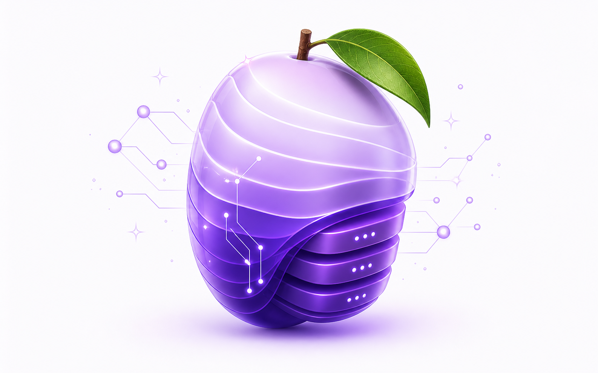

<div align="center">
  <picture>
    <source srcset="ui/public/assets/mango-empty-hero-dark.png" media="(prefers-color-scheme: dark)">
    
  </picture>

  <h1>Mango</h1>
  <p><strong>A friendly MongoDB workbench.</strong> Browse, edit, query, and shell into any MongoDB — with an AI assistant that understands your schema.</p>

  <p>
    <a href="https://github.com/philbir/mango/pkgs/container/mango"></a>
    <a href="https://www.nuget.org/packages/Mango.Hosting"></a>
    <a href="LICENSE"></a>
  </p>
</div>

---

## Run modes

> [!IMPORTANT]
> Mango is a privileged database management tool and currently has no built-in user authentication. Run it only on your local machine or inside a trusted private network. Do not expose Mango directly to the public internet; if you need remote access, put it behind an authenticating reverse proxy, TLS, and network allowlisting.

| | When to use |
|---|---|
| **Aspire** | You're building on .NET Aspire. One line in your AppHost wires Mango to your Mongo container. |
| **Docker** | Standalone deployment: dev box, homelab, k8s. One image, env-driven config. |
| **Desktop** | Local workbench across multiple Mongo connections. macOS, Windows, Linux — runs offline. |

## Quick start

### Aspire

```csharp
using Aspire.Hosting;

var builder = DistributedApplication.CreateBuilder(args);

var mongo = builder.AddMongoDB("mongo")
    .WithLifetime(ContainerLifetime.Persistent);

mongo.WithMango();          // ← drops the Mango UI alongside Mongo

builder.Build().Run();
```

```bash
dotnet add package Mango.Hosting
```

`WithMango()` defaults to **standalone mode**: the Mongo container's connection string is wired in as the only connection and the connection-manager UI is hidden. Pass `standalone: false` to expose the full multi-connection workbench. Override the image with `image:` / `tag:` parameters.

### Docker

```bash
docker run --rm -p 127.0.0.1:5180:5180 \
  -e MONGO_URL="mongodb://host.docker.internal:27017/mydb" \
  -e MANGO_MODE=standalone \
  -v mango-data:/data \
  ghcr.io/philbir/mango:latest
```

Open <http://localhost:5180>. Drop `MANGO_MODE=standalone` to enable the full connection manager (you can then add more connections from the UI).

Or with `docker compose`:

```yaml
services:
  mongo:
    image: mongo:7
    volumes: ["mongo-data:/data/db"]

  mango:
    image: ghcr.io/philbir/mango:latest
    depends_on: [mongo]
    ports: ["127.0.0.1:5180:5180"]
    environment:
      MONGO_URL: mongodb://mongo:27017/mydb
      MANGO_MODE: standalone
    volumes: ["mango-data:/data"]

volumes:
  mongo-data:
  mango-data:
```

### Desktop

Download the installer for your OS from [Releases](https://github.com/philbir/mango/releases) and run it. The desktop app ships a self-contained server (Bun-compiled sidecar) with no external dependencies.

To build locally:

```bash
yarn install
yarn compile-server     # builds the sidecar binary (requires Bun)
yarn tauri:build        # produces a .dmg / .msi / .deb / .AppImage
```

## Configuration

All modes read the same env vars:

| Variable | Purpose |
|---|---|
| `MONGO_URL` | Mongo connection string. Required in standalone mode. |
| `MONGO_DB` | Default database (overrides URI path). |
| `MANGO_MODE` | `standalone` or unset (= multi-connection). |
| `MANGO_DATA_DIR` | Where SQLite + saved settings live. Defaults: `./.mango/` (dev), `/data` (Docker), OS app-data (desktop). |
| `MANGO_MASTER_KEY` | 32-byte AES-256-GCM key (base64 or hex) for encrypting saved connection URIs. Auto-generated per-process if unset. **Set this in production** so saved state survives restarts. |
| `PORT` | Server port. Default `5180`. |
| `HOST` / `MANGO_HOST` | Server bind host. Default `127.0.0.1`; set explicitly only for trusted private-network access. |
| `MANGO_CORS_ORIGINS` | Comma-separated extra browser origins allowed to call the API. Defaults include the Vite dev origin. |
| `MANGO_MONGO_MAX_TIME_MS` | MongoDB query/command timeout in milliseconds for supported operations. Default `10000`. |
| `MANGO_DISABLE_JS_CONSOLE` | Set to `true` to disable the JavaScript console route. |

### AI assistant

| Variable | Purpose |
|---|---|
| `AI_PROVIDER` | `openai` (any OpenAI-compatible endpoint), `copilot`, or `claude-code`. |
| `AI_MODEL` | e.g. `gpt-4o-mini`, `claude-sonnet-4.5`. |
| `AI_API_KEY` | Provider key. OpenAI / GitHub Models / Azure / Ollama. |
| `AI_BASE_URL` | OpenAI provider only — point at GitHub Models, Azure, Ollama, etc. |
| `GITHUB_TOKEN` | Copilot provider — falls back to logged-in Copilot CLI session if unset. |

You can also configure the assistant from the UI (Settings menu); it'll be persisted (encrypted) in the SQLite store.

## Development

```bash
yarn install
yarn dev                # server (5180) + Vite (5173) concurrently
yarn test               # vitest (server)
yarn workspace @mango/ui typecheck
```

The server is ESM Node 22 + [Hono](https://hono.dev) + the official `mongodb` driver, with a SQLite-backed connection store (`better-sqlite3` on Node, `bun:sqlite` in the Tauri sidecar). The UI is React 19 + Vite + Tailwind + Monaco. The desktop shell is Tauri 2.

See [CLAUDE.md](CLAUDE.md) for the architecture overview.

## Roadmap

See [docs/ROADMAP.md](docs/ROADMAP.md). Headlines:

- Phase 1 — Connection manager, AES-GCM encryption, AI assistant, Aspire integration, standalone mode ✅
- Phase 2 — Distribution: Docker / NuGet / Tauri desktop builds ✅ · code signing + auto-update next
- Phase 3 — Mongo auth: OIDC (`MONGODB-OIDC`), X.509, AWS IAM
- Phase 4 — Index manager, import/export (JSONL/CSV), saved commands (SQLite + Git provider sync), aggregation builder

## License

MIT
